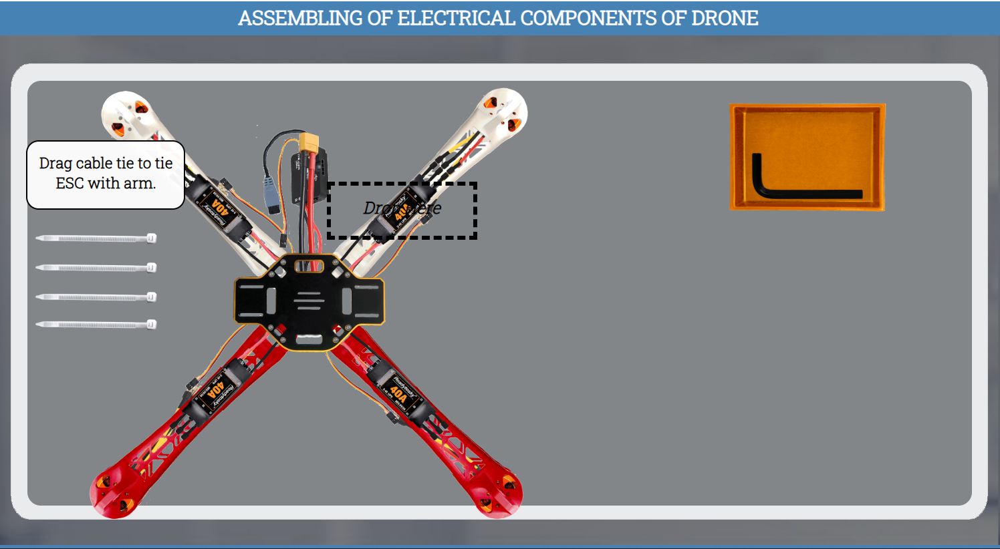

### Procedure

#### Click Here to Enter the Lab
#### 

<!--
### Precautions

#### 1. No cell phone or ear phone usage in the laboratories.
#### 2. Know locations of laboratory safety showers, eyewashstations, and fire extinguishers.
#### 3. Determine the potential hazards before beginning any work.
#### 4. Avoid wearing jewellery in the lab as this can pose multiple safety hazards.
#### 5. Long hair and loose clothing must be pulled back and secured.
#### 6. Avoid contact with energized electrical circuits.
#### 7. Do not touch anything if your hands are wet. The "one-hand" approach is safest.
#### 8. Do not make circuit changes or perform any wiring when power is on.
#### 9. All equipment should be regularly inspected for wear or deterioration.
#### 10. Know emergency exit routes.
-->

#### Click the next button
#### 

#### Click the ok button
#### 

#### Drag Center plate and put it on the center of the table.
#### 

#### Click the ok button
#### 

#### Click on soldering iron for pre-soldering of center plate.
#### 

#### Click the ok button
#### 

#### Drag ESC and put it near the Center plate.
#### 

#### Click on soldering iron to solder ESC's red and black wires with center plate.
#### 

#### NOTE- Repeat the same process with other 3 ESCs.
#### Click the next button
#### 

#### Test Your Memory
#### Choose the option and click on the submit button
#### 

#### Click the next button
#### 

#### Click on soldering iron for pre-soldering of center plate.
#### 

#### Click the ok button
#### 

#### Drag deans plug and put it near the center plate.
#### 

#### Click on soldering iron to solder Deans plug's red and black wires with center plate.
#### 

#### Click the ok button
#### 

#### Drag PMU and put it near the center plate.
#### 

#### Click on soldering iron to solder PMU red and black wires with center plate.
#### 

#### Click the next button
#### 

#### Test Your Memory
#### Choose the option and click on the submit button
#### 

#### Click the next button
#### 

#### Click the ok button
#### 

#### Click on the button of digital multimeter to turn on digital multimeter.
#### 

#### Drag red and black pin one by one of digital multimeter and touch it with the soldering points of deans plug and PMU to check connections.
#### 

#### Again drag black pin and touch it with the other soldering point to check another connection.
#### 

#### NOTE- Check all connections one by one with the help of digital multimeter.
#### Click the ok button
#### 

#### Drag black and red wires one by one and put it back near digital multimeter.
#### 

#### Click on the button of digital multimeter to turn Off digital multimeter.
#### 

#### Click the ok button
#### 

#### Drag glue gun and drop it on the center plate to apply hot glue on the soldering points to prevent short circuit.
#### 

#### NOTE- Apply hot glue on all the soldering points to prevent short circuit.
#### Click the next button
#### 

#### Test Your Memory 
#### Choose the option and click on the submit button
#### 

#### Click the next button
#### 

#### Click the ok button
#### 

#### Drag red arm and put it on the middle of the table.
#### 

#### Click the ok button
#### 

#### Drag motor and put it on the red arm.
#### 

#### Click on arm to flip it.
#### 

#### Drag screws one by one and put them on the arm to attach motor.
#### 

#### Click the ok button
#### 

#### Drag Allen Key and drop it on the screws one by one to tight all screws.
#### 

#### NOTE- Repeat the same process with other 3 arms and motors.
#### Click the next button
#### 

#### Test Your Memory 
#### Choose the option and click on the submit button
#### 

#### Click the next button
#### 

#### Click on center plate to flip the plate.
#### 

#### Drag all arms one by one and put them near the center plate to attach them with center plate.
#### 

#### Drag screws one by one and put them on the center plate to attach arms.
#### 

#### Drag allen key and put it on the center plate to tight all screws.
#### 

#### Click on white arm to see the zoom view.
#### 
 
#### Drag yellow wire of motor and attach with ESC's socket 1.
#### 

#### Drag black wire of motor and attach with ESC's socket 2.
#### 

#### Drag red wire of motor and attach with ESC's socket 3.
#### 

#### Drag cable tie to tie ESC with arm.
#### 

#### NOTE- Repeat the same process with other 3 ESCs.
#### Click the next button
#### 

#### Thank You For Performing the Experiment
#### 
