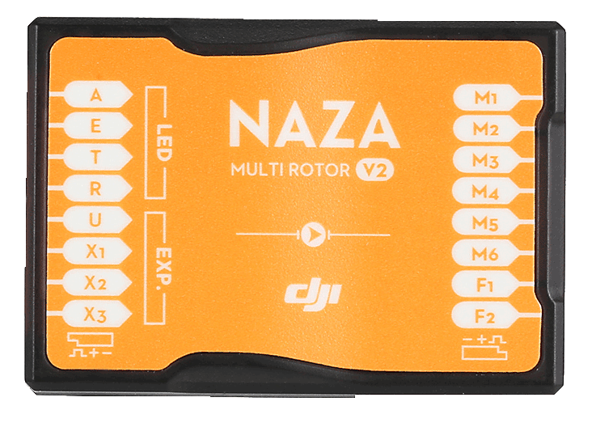
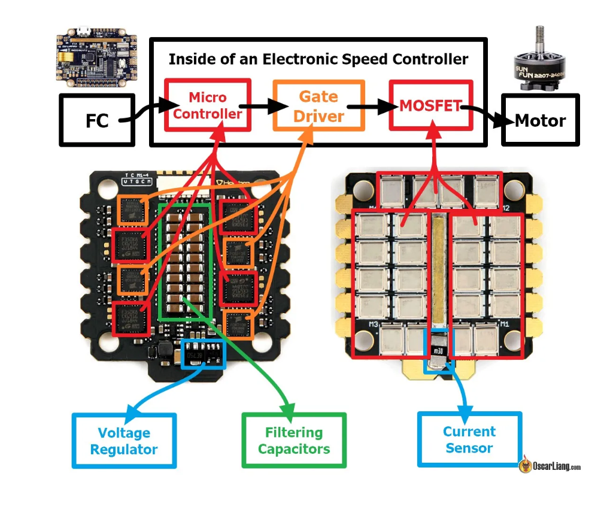
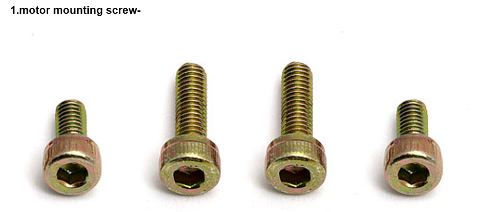
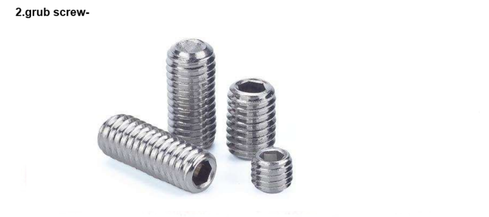

### Theory

#### DEFINITION OF DRONE (QUADCOPTER)

Quadcopter is an unmanned aerial vehicle (UAV) or drone with four rotors,each with a motor and propeller.A quadcopter can be manually controlled or can be autonomous.It is also called quadcopter helicopter or quadrotor.It belongs to a more general class of aerial vehicles called multicopter or multirotor.Quadcopters provide stable flight performance,making them ideal for surveillance and aerial photography.

#### PRINCIPLE OF DRONE (QUADCOPTER)

Quadcopters generally have two rotors spinning clockwise (CW) and two counterclockwise (CCW). Flight control is provided by independent variation of the speed and hence lift and torque of each rotor. Pitch and roll are controlled by varying the net centre of thrust, with yaw controlled by varying the net torque.  
Unlike conventional helicopters, quadcopters do not usually have cyclic pitch control, in which the angle of the blades varies dynamically as they turn around the rotor hub. In the early days of flight, quadcopters (then referred to either as 'quadrotors' or simply as 'helicopters') were seen as a possible solution to some of the persistent problems in vertical flight. Torque-induced control issues (as well as efficiency issues originating from the tail rotor, which generates no useful lift) can be eliminated by counter-rotation, and the relatively short blades are much easier to construct. A number of manned designs appeared in the 1920s and 1930s. These vehicles were among the first successful heavier-than-air vertical take off and landing (VTOL) vehicles. However, early prototypes suffered from poor performance, and latter prototypes required too much pilot work load, due to poor stability augmentation and limited control authority.  

#### COMPONENTS OF DRONE

The first step to building a drone is to understand the components that it required for operation.
every drone consist of following basic and essential parts<

#### Arms

The arms of the frame are available in 2 red and 2 white colours which can guide you to fly in the right direction.Arms have support ridges on them,which improves stability and provides faster forward flight

#### Center Plate

The center plate is a crucial component of a multirotor drone's frame, connecting all structural elements and housing essential electronics. In the event of a crash, while other parts may remain intact, the center plate is susceptible to damage due to its central position and the stresses it endures. Many frame kits include center plates with integrated power distribution boards (PDBs), which streamline the wiring by distributing power from the main battery to the electronic speed controllers (ESCs) and other components. The spacious design of the center plate also facilitates the mounting of gimbals and cameras, enhancing capabilities for first-person view (FPV) flights and aerial photography.

  

 

#### Deans Plugs

Deans Plugs are the smallest high-current connectors we know of,and they are great for projects that involve biggest motors and controllers.Often used to connect batteries in radio control models.

  

 

#### FC (FLIGHT CONTROLLER)

A Flight Controller (FC) is the central processing unit of a drone that receives inputs from various sensors (such as gyroscope, accelerometer, and GPS) and processes them to control the drone’s stability, orientation, and movement. When connected to Electronic Speed Controllers (ESCs), the flight controller sends precise signals to adjust the motor speeds, ensuring smooth and stable flight. The ESC acts as a bridge between the flight controller and the motors, converting low-power control signals from the FC into high-power electrical pulses that drive the brushless motors. Different drones use various ESC protocols (such as PWM, OneShot, MultiShot, and DShot) to communicate with the flight controller, affecting response time and efficiency. Proper synchronization between the FC and ESCs is crucial for accurate flight control, maneuverability, and power efficiency.

  

 

#### ESC (ELECTRONIC SPEED CONTROLLER)

An ESC is a device that interprets signals from the flight controller, and translates those signals into phased electrical pulses to determine the speed of a brushless motor. Make sure that both your FC and ESC’s are capable of running the same ESC protocol ie. DShot 600.  When selecting an ESC, remember that the current rating must be higher than the amperage drawn by your combination of motors and props.
These days an ESC has 4 input terminals, 2 are for signals coming from the FC. Signal and signal ground are wired to the FC, the 2 heavier wires are for Positive and Negative, they carry the high current to the ESC to supply the motor. These Positive and negative are wired to the PDB. An ESC has 3 output terminals, one for each of the wires of a brushless motor. Some ESC’s now offer telemetry.

  

 

##### Method for a User to Check ESC Protocol:

To check the ESC protocol used in a drone, a user can follow a few simple steps. First, connect the drone’s Flight Controller (FC) to a computer using a USB cable and open a configuration software like Betaflight, BLHeli Configurator, or INAV. Navigate to the ESC/Motor settings section, where the current ESC protocol (such as PWM, OneShot, MultiShot, or DShot) is displayed. If the protocol is not explicitly mentioned, users can try changing it in the settings and testing motor response. Another method is to check the ESC specifications provided by the manufacturer, which usually list the supported protocols. Additionally, experienced users can observe the motor response; faster protocols like DShot result in smoother and quicker throttle response compared to traditional PWM signals. Properly identifying and setting the right ESC protocol ensures optimal performance and responsiveness in flight.

##### Example of Comparing Current Rating When Choosing the Right ESC:

When choosing the right ESC (Electronic Speed Controller), comparing the current rating is crucial to ensure safe and efficient operation. For example, if a drone motor has a maximum current draw of 20A, selecting an ESC rated at 20A or slightly higher (e.g., 25A or 30A) is ideal to prevent overheating or failure. If the ESC is underrated, such as using a 15A ESC for a 20A motor, it may overheat and burn out under load. On the other hand, choosing an ESC with a much higher rating, like 50A for a 20A motor, would work but might add unnecessary weight and cost. Therefore, it is best to choose an ESC with a current rating slightly higher than the motor’s maximum draw to ensure reliability and performance while maintaining efficiency.

##### Diagram Showcasing the Arrangement (Connections) Between ESC, FC, PDB:
  

 

#### Motors

The motors are the main drain of battery power on your quad, therefore getting an efficient combination of propeller and motor is very important. Motor speed is rated in kV, generally a lower kV motor will produce more torque and a higher kV will spin faster, this however is without the prop attached.
There are many aspects to motor performance aside from raw thrust, high among these is how much current the motor draws from the battery. Remember to check the specs of your motors for their maximum amp draw, and ensure that your ESC’s are rated to withstand this amperage.

Builders tip : The brushless motors that are most commonly used on a miniquad have 3 wires, it doesn’t really matter which of the 3 output terminals these are connected to on the ESC, swapping any of the 3 will change the direction of rotation. Motor rotation can be set in BL_Heli configurator.

Note- Remember to ensure that the motor mounting screws are not too long and that they do not touch the stator windings of the motor. This contact can cause a short in the windings, spelling the end for your motor, also make sure that any grub screws are fitted and tightened.

  

 

#### PROPELLERS

Propellers are essential components of a drone that generate thrust by rotating and pushing air downwards, enabling lift and movement. They come in various sizes and pitches, with larger propellers providing more lift but requiring higher torque. The material of the propeller, such as plastic or carbon fiber, affects durability and performance. Balanced propellers reduce vibrations, ensuring smoother flights and better stability.

> **Builder’s Tip:** Propellers are often labeled with dimensions such as 5x3, where “5” indicates the diameter in inches and “3” represents the pitch. Balancing propellers before flight is crucial for minimizing vibrations.

---

#### PROPELLER-MOTOR INTERRELATIONS

The performance of a drone depends on the correct pairing of propellers and motors. A motor's KV rating (RPM per Volt) determines how fast it spins, which directly influences the thrust output of the propeller.

- **Low-KV motors** are suited for larger propellers, providing efficient thrust at lower RPMs.
- **High-KV motors** are ideal for smaller propellers, delivering faster response and agility.

Choosing the right propeller-motor combination ensures optimal **efficiency**, **flight time**, and **maneuverability** based on the drone's intended application.

  

 

  

 