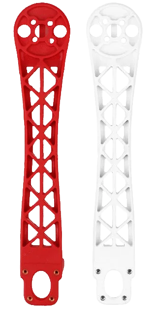

### Theory

#### DEFINITION OF DRONE(QUADCOPTER)

Quadcopter is an unmanned aerial vehicle (UAV) or drone with four rotors,each with a motor and propeller.A quadcopter can be manually controlled or can be autonomous.It is also called quadcopter helicopter or quadrotor.It belongs to a more general class of aerial vehicles called multicopter or multirotor.Quadcopters provide stable flight performance,making them ideal for surveillance and aerial photography.

#### PRINCIPLE OF DRONE(QUADCOPTER)

Quadcopters generally have two rotors spinning clockwise (CW) and two counterclockwise (CCW). Flight control is provided by independent variation of the speed and hence lift and torque of each rotor. Pitch and roll are controlled by varying the net centre of thrust, with yaw controlled by varying the net torque.  
Unlike conventional helicopters, quadcopters do not usually have cyclic pitch control, in which the angle of the blades varies dynamically as they turn around the rotor hub. In the early days of flight, quadcopters (then referred to either as 'quadrotors' or simply as 'helicopters') were seen as a possible solution to some of the persistent problems in vertical flight. Torque-induced control issues (as well as efficiency issues originating from the tail rotor, which generates no useful lift) can be eliminated by counter-rotation, and the relatively short blades are much easier to construct. A number of manned designs appeared in the 1920s and 1930s. These vehicles were among the first successful heavier-than-air vertical take off and landing (VTOL) vehicles. However, early prototypes suffered from poor performance, and latter prototypes required too much pilot work load, due to poor stability augmentation and limited control authority.  

#### COMPONENTS OF DRONE

The first step to building a drone is to understand the components that it required for operation.
every drone consist of following basic and essential parts<

#### Arms

The arms of the frame are available in 2 red and 2 white colours which can guide you to fly in the right direction.Arms have support ridges on them,which improves stability and provides faster forward flight

#### Center Plate

This plate is usually needed when the multirotor has crash and all parts is perfect but centre plate has broken.The frame kit requires assembling and comes with center plates with integrated power distribution PCB to power the ESCs from the battery.Large center Plate allows mounting of gimbals and camera for FPV and aerial photography.

  

 

#### Deans Plugs

Deans Plugs are the smallest high-current connectors we know of,and they are great for projects that involve biggest motors and controllers.Often used to connect batteries in radio control models.

  

 

#### ESC(ELECTRONIC SPEED CONTROLLER)

An ESC is a device that interprets signals from the flight controller, and translates those signals into phased electrical pulses to determine the speed of a brushless motor. Make sure that both your FC and ESC’s are capable of running the same ESC protocol ie. DShot 600.  When selecting an ESC, remember that the current rating must be higher than the amperage drawn by your combination of motors and props.
These days an ESC has 4 input terminals, 2 are for signals coming from the FC. Signal and signal ground are wired to the FC, the 2 heavier wires are for Positive and Negative, they carry the high current to the ESC to supply the motor. These Positive and negative are wired to the PDB. An ESC has 3 output terminals, one for each of the wires of a brushless motor. Some ESC’s now offer telemetry.

  

 

#### Motors

The motors are the main drain of battery power on your quad, therefore getting an efficient combination of propeller and motor is very important. Motor speed is rated in kV, generally a lower kV motor will produce more torque and a higher kV will spin faster, this however is without the prop attached.
There are many aspects to motor performance aside from raw thrust, high among these is how much current the motor draws from the battery. Remember to check the specs of your motors for their maximum amp draw, and ensure that your ESC’s are rated to withstand this amperage.

Builders tip : The brushless motors that are most commonly used on a miniquad have 3 wires, it doesn’t really matter which of the 3 output terminals these are connected to on the ESC, swapping any of the 3 will change the direction of rotation. Motor rotation can be set in BL_Heli configurator.

Note- Remember to ensure that the motor mounting screws are not too long and that they do not touch the stator windings of the motor. This contact can cause a short in the windings, spelling the end for your motor, also make sure that any grub screws are fitted and tightened.

  

 
